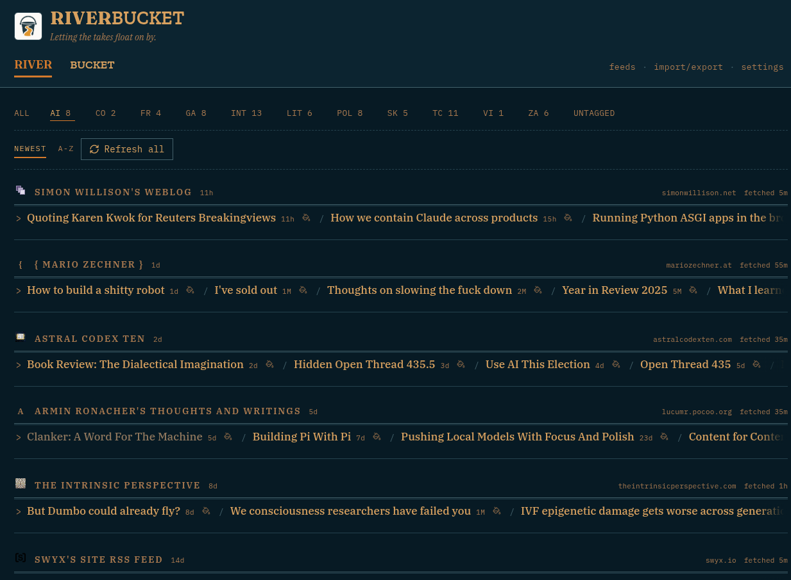
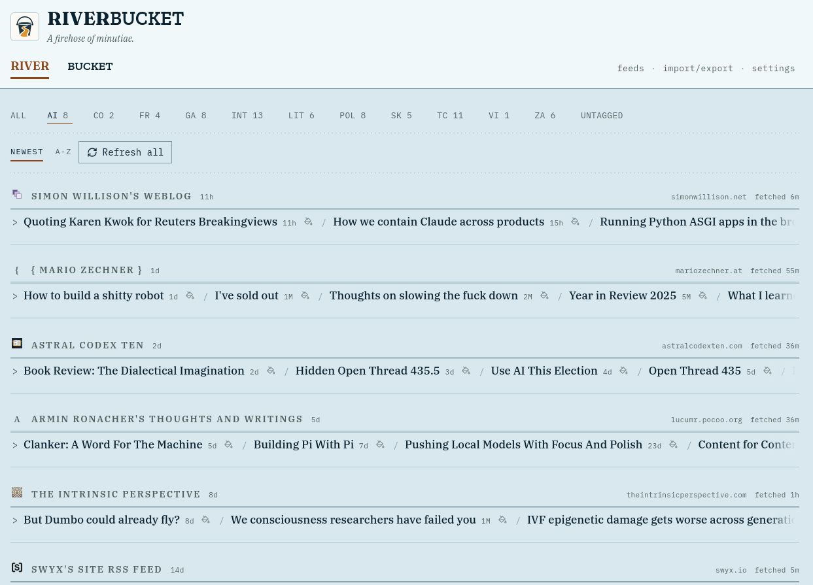
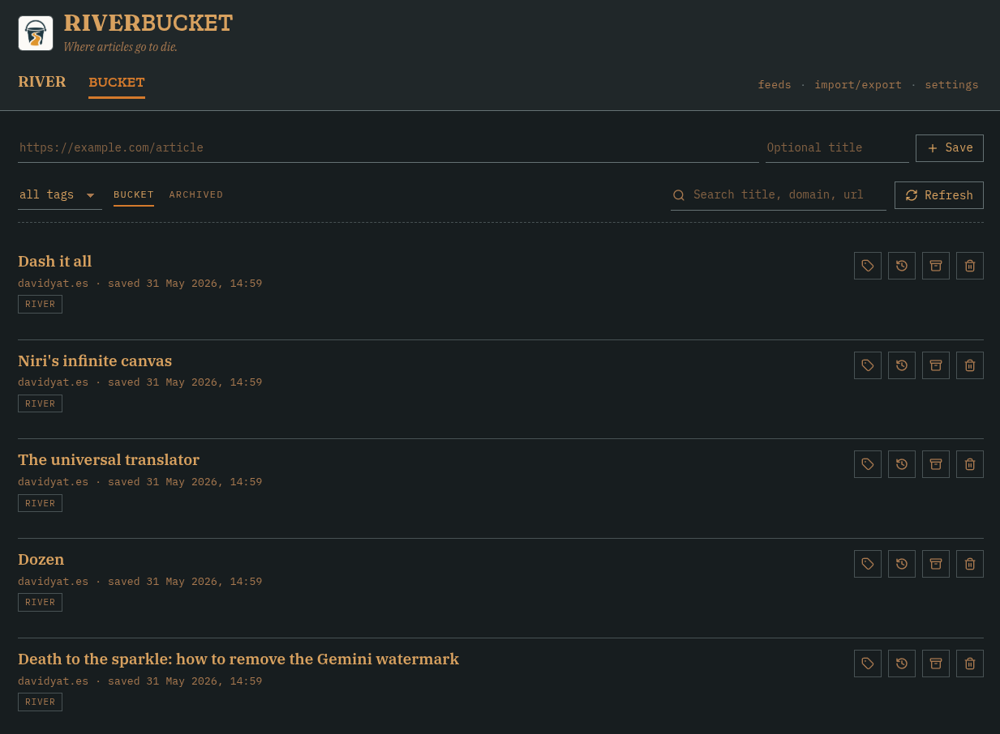
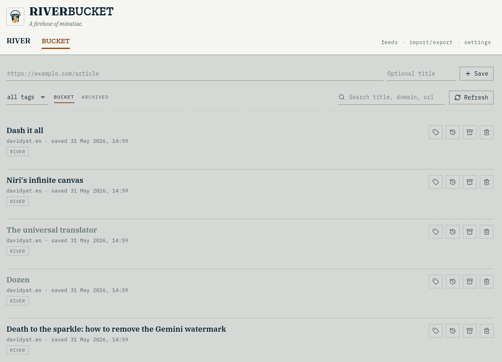

<h1>
  
  Riverbucket
</h1>
<br clear="left">

Riverbucket is an app with two faces:

- **River**: an organized collection of recent posts from your lovingly curated collection of RSS/Atom feeds.
- **Bucket**: a list of links from around the web, bookmarked for later reading.

## Features

- Subscribe by feed or site URL -- this includes blogs, YouTube channels and playlists, Medium profiles/tags/publications, Mastodon accounts, Reddit listings and GitHub releases/tags/commits. Subscriptions are updated periodically or on demand.
- Browse recent feed items grouped by tag and source.
- Save feed items to the bucket with one click.
- Configure select feeds to automatically save new entries to the bucket.
- Keep river, bucket, feeds, tags, refresh state, and extension-token metadata synchronized across open tabs and devices.
- Import and export feeds via OPML and bookmarks via JSON/HTML.
- Add sites to the river current site and pages to the bucket through the companion webextension.

## Screenshots

| River, dark theme | River, light theme |
| --- | --- |
|  |  |

| Bucket, dark theme | Bucket, light theme |
| --- | --- |
|  |  |

## Non-features

Riverbucket intentionally does not do any of the following:

- Track or count which feed items you have or haven't read like an email inbox.
- Provide a reader mode or text backup for article content.
- Provide algorithmic ranking or similar content suggestions.
- Use LLMs to summarise articles or provide digests.

## Deployment and usage

Riverbucket is a single-user Cloudflare Workers app, with a password for authentication. To use it, sign up for a free Cloudflare account and follow these steps to deploy it with [Wrangler](https://developers.cloudflare.com/workers/wrangler/).

Install dependencies:

```bash
npm install
```

Create your Wrangler config from the example:

```bash
cp wrangler.example.jsonc wrangler.jsonc
```

Create the remote D1 database and feed refresh queue:

```bash
npx wrangler d1 create riverbucketdb
npx wrangler queues create riverbucket-feed-refresh
```

The checked-in Wrangler configuration also provisions the `AppSync` Durable Object used for live synchronization when the Worker is deployed.

Copy the D1 database ID from the `wrangler d1 create` output into `wrangler.jsonc` as `database_id`, or update the existing value if your checkout already has a config. If you change the database or queue names, update both `wrangler.jsonc` and the matching database name in the `db:migrate:*` scripts in `package.json`.

Generate a password hash:

```bash
npm run password:hash -- "YOUR-SUPER-SECURE-PASSWORD-HERE"
```

It should resemble this: `pbkdf2-sha256$...`. Paste it into a secret:

```bash
npx wrangler secret put APP_PASSWORD_HASH
```

Then generate and set a session-signing secret:

```bash
openssl rand -base64 48
npx wrangler secret put SESSION_SECRET
```

Apply the remote database migrations:

```bash
npm run db:migrate:remote
```

And finally, deploy to Cloudflare Workers:

```bash
npm run deploy
```

Your instance should then be available at https://riverbucket.YOURNAME.workers.dev. Log in with your password and start reading.

## Browser extension

The extension lives in `extension/`. To install it:

1. Open your browser's extensions page.
2. Enable Developer Mode.
3. Load `extension/` as an unpacked extension.
4. Configure the Riverbucket app URL and an extension token in the extension options. You can provision extension tokens from the **Settings** tab on your Riverbucket instance.

The extension can save the current page, save right-clicked links, and discover feeds from the current page.

## Development

Install dependencies:

```bash
npm install
```

Run the frontend dev server:

```bash
npm run dev
```

Typecheck the app and Worker:

```bash
npm run typecheck
```

Build the frontend and typecheck the Worker:

```bash
npm run build
```

Apply D1 migrations locally:

```bash
npm run db:migrate:local
```

Apply D1 migrations remotely:

```bash
npm run db:migrate:remote
```

The configured production D1 database name is `riverbucketdb`.

## Contributions

This project was vibe-coded (with love). As its creator, I reserve for myself the special and exclusive privilege of continued vibing. Outside contributors are held to stricter standards.

1. **You must understand and be able to defend the code you're submitting.** A set of high-level matrix calculations cannot take responsibility, and "that's what the AI decided to do" is never a good enough explanation.
2. **You must make all commits yourself with your own commit messages.** No Claude co-authoring: I reserve that right for myself.

Of course, you are also welcome to fork this project and do whatever you want with it, subject to the license. But if you want to contribute upstream, please follow these two rules.

## License

Riverbucket is licensed under the GNU Affero General Public License v3.0. See [LICENSE](LICENSE).
